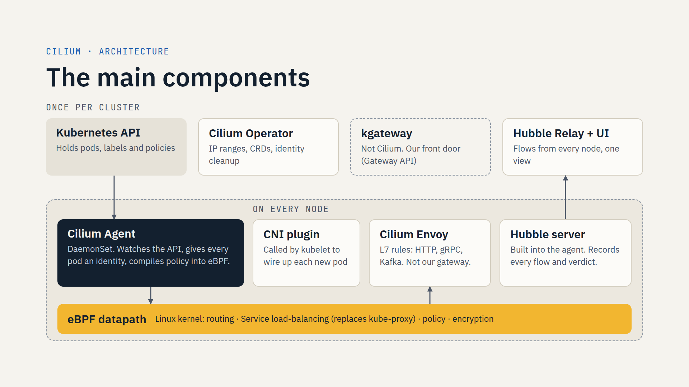
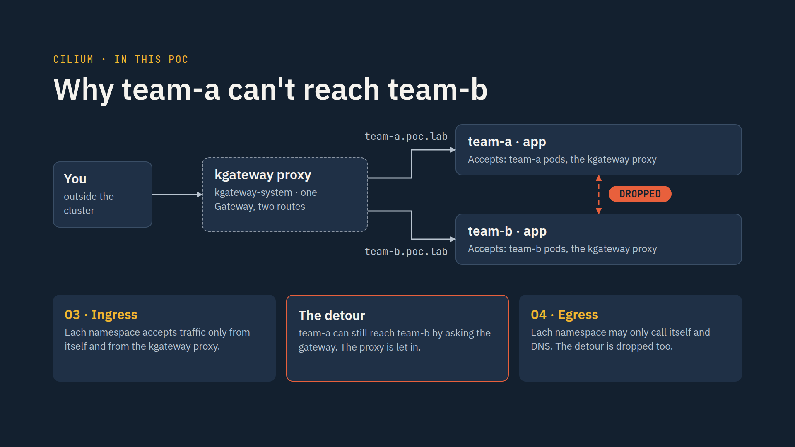

# Cilium POC: namespace isolation behind kgateway

Two teams share a cluster. Each has its own namespace with one workload, and
kgateway is the front door. Cilium keeps the two teams apart.

## What we want to achieve

1. **team-a cannot curl team-b, and team-b cannot curl team-a.** That covers
   the Service name, the pod IP, and a detour through the gateway.
2. **Both apps stay reachable from outside through kgateway**, the cluster's
   Gateway API implementation.
3. **Every blocked connection is visible**, with its reason (Hubble:
   `Policy denied`).
4. **Nothing changes in the apps.** Cilium enforces the rules in the kernel
   (eBPF), based on pod identities derived from labels, not on IP addresses.

Done means this matrix after the last step (`./matrix.sh` prints it):

| from | to | result |
|---|---|---|
| team-a | `app.team-a` (own namespace) | allowed |
| team-a | `app.team-b` | **blocked** |
| team-b | `app.team-b` (own namespace) | allowed |
| team-b | `app.team-a` | **blocked** |
| you, via kgateway | `team-a.poc.lab`, `team-b.poc.lab` | allowed |
| team-a, via kgateway | `team-b.poc.lab` | **blocked** |
| team-b, via kgateway | `team-a.poc.lab` | **blocked** |

## The design

```
                       kgateway-system
  you ─────────► [ kgateway proxy "cilium-poc" ] ──► team-a.poc.lab ──► team-a / app (2 pods)
  (port-forward)                                  └─► team-b.poc.lab ──► team-b / app (2 pods)

  team-a ──✗──► team-b       step 03: each namespace accepts only itself + the proxy
  team-b ──✗──► team-a
  team-a ──✗──► proxy        step 04: each namespace may only call itself + DNS
  team-b ──✗──► proxy                 (closes the detour through the gateway)
```

| Policy (`CiliumNetworkPolicy`) | In | Allows | Step |
|---|---|---|---|
| `isolate-ingress` | team-a, team-b | **in** from its own namespace; from the `cilium-poc` proxy on 8080 | 03 |
| `isolate-egress` | team-a, team-b | **out** to its own namespace; to CoreDNS on 53 | 04 |

**Why two steps.** Step 03 alone stops direct traffic, but team-a can still ask
the gateway for `team-b.poc.lab`. The gateway forwards the request, and team-b
has to let the gateway in. Ingress rules can't tell a real user from team-a
taking a detour, so step 04 stops the teams from opening connections to the
gateway at all. Outside users are unaffected: replies are connection-tracked.

**Why the proxy label is trusted.** kgateway labels its proxy pods
`gateway.networking.k8s.io/gateway-name=<Gateway>`. The policies match that
label *and* the namespace `kgateway-system`, where only the platform can create
pods. A team can't put a pod there, so it can't pass itself off as the gateway.

## What's in this folder

| Path | What |
|---|---|
| `manifests/00-namespaces.yaml` | `team-a`, `team-b` (restricted Pod Security) |
| `manifests/01-workloads.yaml` | `app` in each: nginx answering `hello from team-x`, 2 replicas, Service on port 80 |
| `manifests/02-gateway.yaml` | Gateway `cilium-poc` in `kgateway-system` (ClusterIP only) and one HTTPRoute per team |
| `manifests/03-isolate-ingress.yaml` | Step 03: ingress isolation |
| `manifests/04-isolate-egress.yaml` | Step 04: egress isolation, closes the gateway detour |
| `matrix.sh` | Who can reach whom right now, plus the latest Hubble drops. Read-only |
| `slides/cilium-poc-slides.html` | The two slides: Cilium's components, and this POC |
| `slides/*.png` | The same two slides as 1920×1080 images |

## Before you start

The manifests target a cluster that already has:

- **Cilium as the CNI**, with Hubble enabled if you want to see the drops.
- **kgateway v2.x**: GatewayClass `kgateway`, controller in `kgateway-system`.
  Gateway API v1 CRDs.
- **CoreDNS** labelled `k8s-app=kube-dns` in `kube-system` (step 04 allows it).
- The image `docker.io/nginxinc/nginx-unprivileged:1.31-alpine`. Mirror it if
  the cluster can't pull from Docker Hub.
- Rights to create namespaces, CiliumNetworkPolicies, and a Gateway plus
  GatewayParameters in `kgateway-system`.

Nothing is exposed outside the cluster: the proxy Service is ClusterIP, and you
reach it with `kubectl port-forward`. For a real entry point, set the type in
`02-gateway.yaml` to `LoadBalancer` or `NodePort`.

If the cluster has a default-deny policy covering `kgateway-system`, the new
proxy also needs egress to team-a and team-b on 8080, to the kgateway
controller on 9977, and to DNS.
[`../soft-tenancy/12-kgateway-ingress/network-policies.yaml`](../soft-tenancy/12-kgateway-ingress/network-policies.yaml)
has that policy for the lab's proxies.

## Run it

Run the commands from this folder, with your usual kubectl context. On the
lab, run `export KUBECONFIG=$PWD/../.state/kubeconfig` first.

**1. Workloads and gateway (open network).**

```bash
kubectl apply -f manifests/00-namespaces.yaml -f manifests/01-workloads.yaml
```
```bash
kubectl -n team-a rollout status deploy/app && kubectl -n team-b rollout status deploy/app
```
```bash
kubectl apply -f manifests/02-gateway.yaml
```
```bash
kubectl -n kgateway-system wait --for=condition=Programmed gateway/cilium-poc --timeout=180s
```
```bash
./matrix.sh
```

If the wait times out but
`kubectl -n kgateway-system get pods -l gateway.networking.k8s.io/gateway-name=cilium-poc`
shows the proxy Running, carry on: that is all the POC needs.

**2. Step 03: isolate on ingress.**

```bash
kubectl apply -f manifests/03-isolate-ingress.yaml && sleep 3 && ./matrix.sh
```

**3. Step 04: isolate on egress, closing the detour.**

```bash
kubectl apply -f manifests/04-isolate-egress.yaml && sleep 3 && ./matrix.sh
```

What `./matrix.sh` should print at each stage:

| from → to | after 02 | after 03 | after 04 |
|---|---|---|---|
| team-a → `app.team-a` | allowed | allowed | allowed |
| team-a → `app.team-b` | allowed | **blocked** | **blocked** |
| team-b → `app.team-b` | allowed | allowed | allowed |
| team-b → `app.team-a` | allowed | **blocked** | **blocked** |
| you → gateway → `team-a.poc.lab` | allowed | allowed | allowed |
| you → gateway → `team-b.poc.lab` | allowed | allowed | allowed |
| team-a → gateway → `team-b.poc.lab` | allowed | allowed (the detour) | **blocked** |
| team-b → gateway → `team-a.poc.lab` | allowed | allowed (the detour) | **blocked** |

"Blocked" means curl gave up after 3 seconds: Cilium dropped the packets, so
nothing came back.

### Things to show while presenting

Each pod's security identity, which is what the policy is written against:

```bash
kubectl get ciliumendpoints -n team-a
```

The drops and their reason. `matrix.sh` prints the latest ones; this shows the
full list (each node's agent sees the drops for its own pods):

```bash
for p in $(kubectl -n kube-system get pods -l k8s-app=cilium -o name); do kubectl -n kube-system exec "$p" -c cilium-agent -- hubble observe --verdict DROPPED --since 10m --namespace team-a --namespace team-b -o compact; done
```

A request from outside, by hand:

```bash
kubectl -n kgateway-system port-forward deploy/cilium-poc 8080:8080
```
```bash
curl -H 'Host: team-a.poc.lab' http://127.0.0.1:8080/
```

If the Hubble UI is installed, its service map shows the dropped flows in red:

```bash
kubectl -n kube-system port-forward svc/hubble-ui 12000:80
```

## Roll back and clean up

Back to an open network, keeping the apps:

```bash
kubectl delete -f manifests/04-isolate-egress.yaml -f manifests/03-isolate-ingress.yaml
```

Remove everything the POC created:

```bash
kubectl delete -f manifests/ --ignore-not-found
```

## Slides

[`slides/cilium-poc-slides.html`](slides/cilium-poc-slides.html) works in any
browser, offline included (fonts fall back to Arial and Courier New). Keys:
right arrow, space or click for next, left arrow for back, `N` for speaker
notes, `F` for full screen. Print to PDF gives one slide per page.

The same slides as images, to paste into another deck or a wiki page:

1. **The main components.** Cilium Operator and Hubble Relay run once per
   cluster; Agent, CNI plugin, Envoy and Hubble server run on every node, on
   top of the eBPF datapath. kgateway is drawn beside them: it is not part of
   Cilium.

   

2. **Why team-a can't reach team-b.** This POC: the gateway path, the drop, and
   steps 03 and 04.

   

## Going further

Each of these is already done in [`../soft-tenancy`](../soft-tenancy/README.md):

- **One Gateway per team.** With one shared proxy, Cilium can't tell team-a's
  gateway traffic from team-b's on that hop (step 12).
- **Deny rules.** `ingressDeny`/`egressDeny` win over any allow, so a sloppy
  policy added later can't reopen the path (step 03).
- **DNS filtering.** Other namespaces' names return NXDOMAIN (steps 00 and 03).
- **Lock the proxy's egress**, so a bad route or Backend can't reach anything
  else (step 12).

## Checked so far

The custom resources (4 CiliumNetworkPolicies, Gateway, GatewayParameters, 2
HTTPRoutes) validate against the Cilium, Gateway API v1.6.1 and kgateway v2.4.5
CRD schemas, using `generic/scripts/validate-crs.py`. The POC has not been run
on a cluster yet.
