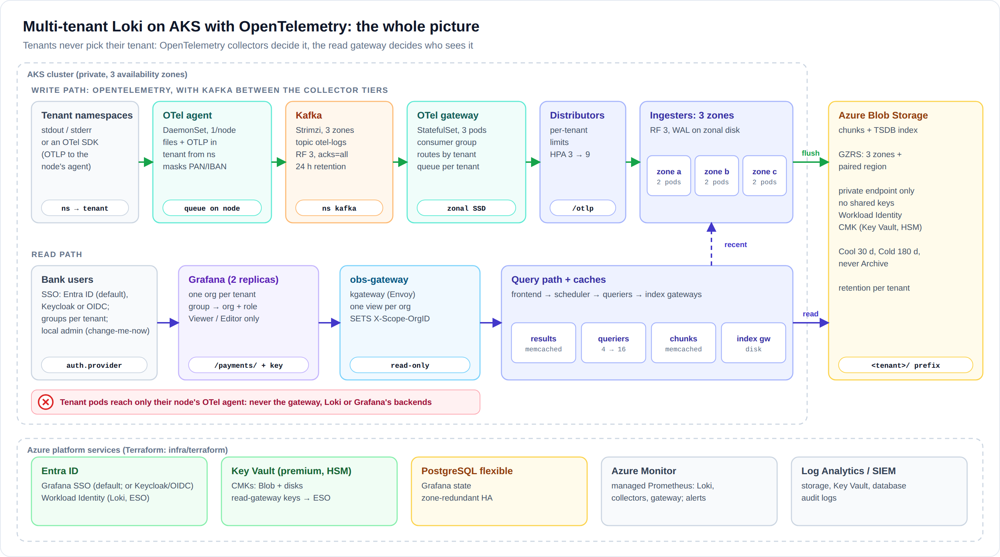
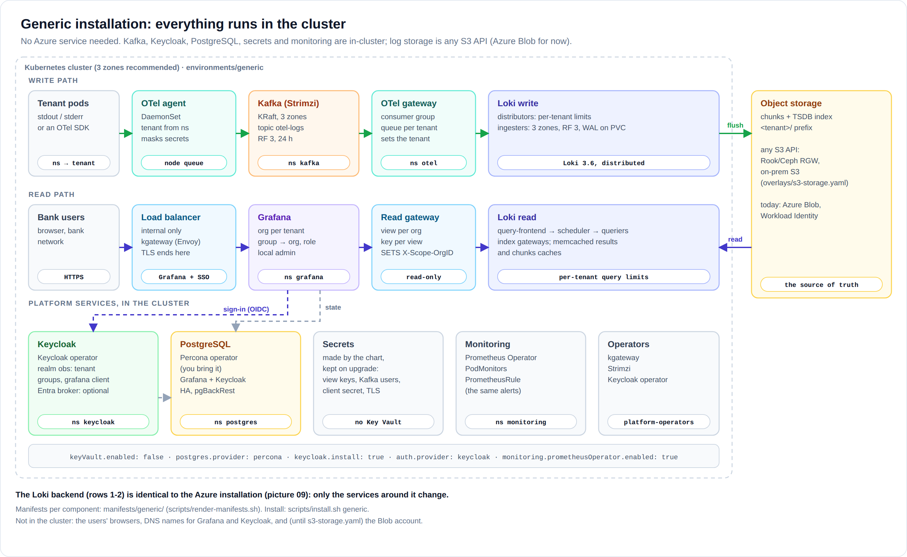
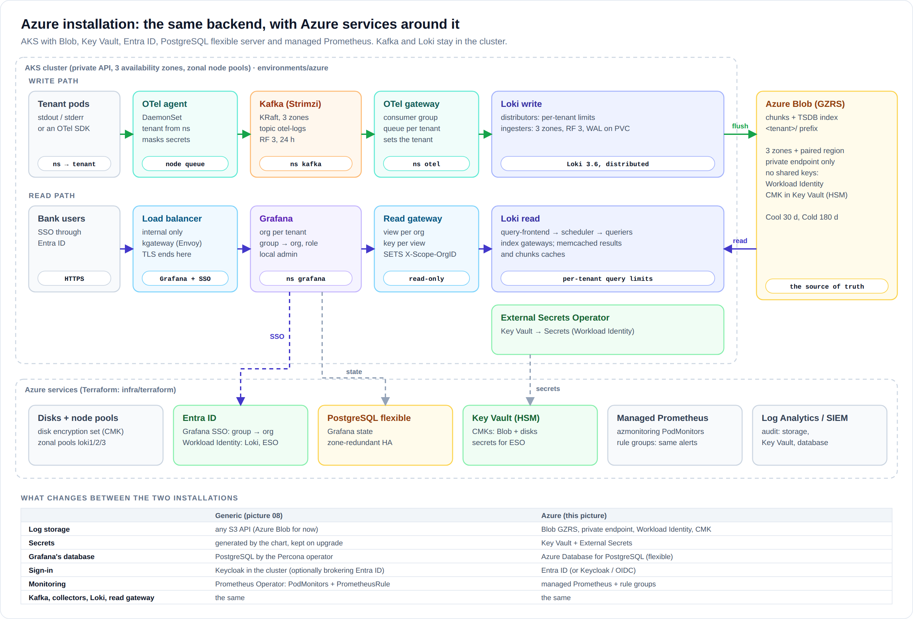

# Multi-tenant Loki on AKS with OpenTelemetry: a reliable log backend for a bank

A production design for the platform team that runs a **shared AKS cluster**
in which each tenant's workloads live in their own, isolated namespaces.
The platform collects every tenant's logs, stores them in one Loki, and lets
each tenant read **only its own logs** through Grafana, signing in with the bank's identity
provider (Entra ID by default, or Keycloak / any OIDC provider; mock users for test clusters).

It is the generic, production version of [`../soft-tenancy`](../soft-tenancy)
(the RKE2 lab): same principles and the same components, hardened for AKS and for a
regulated environment.



**Two installations, one backend** ([docs/10](docs/10-installations.md)):

| Generic: everything in the cluster | Azure: Azure services around it |
|---|---|
| [](diagrams/08-generic-in-cluster.png) | [](diagrams/09-azure-components.png) |
| Kafka (Strimzi), Keycloak, PostgreSQL (Percona), generated secrets, Prometheus Operator; storage on any S3 API (Azure Blob for now) | Blob, Key Vault + External Secrets, Entra ID, PostgreSQL flexible, managed Prometheus; Kafka still in the cluster |
| `environments/generic/` · [`manifests/generic/`](manifests/generic/README.md) | `environments/azure/` · [`manifests/azure/`](manifests/azure/README.md) |

## The design in ten lines

1. **Tenant = namespace**, mapped by the platform (`tenants/tenants.yaml`). A workload never picks its tenant.
2. **OpenTelemetry end to end, with Kafka in the middle**: an OTel **agent** on every node reads container stdout and accepts OTLP from apps' SDKs, and writes to **Kafka** (Strimzi, in the cluster, 3 zones, 24 h). OTel **gateways** consume it and route each tenant through its own persistent queue into Loki's native OTLP endpoint.
3. The agents **mask card numbers, IBANs and bearer tokens** before anything leaves the node, and ignore any identity an app claims.
4. **Loki in distributed mode**: ingesters in **3 availability zones**, replication factor 3, WAL on zonal CMK disks.
5. **Azure Blob Storage (GZRS)** holds everything: private endpoint only, no shared keys, CMK in an HSM Key Vault. Or any S3 API, in the generic installation.
6. **Entra Workload Identity**: no storage keys and no client secrets in the cluster.
7. **Per-tenant limits and retention** (tiers: bronze/silver/gold) from the same registry, reloaded without restarts.
8. **Grafana: one org per tenant**. Sign-in via `auth.provider`: Entra ID (default), Keycloak (which the charts can also install), any OIDC provider, or `disabled` (mock users alice/bob/carol for test clusters). Groups → org + role; users are Viewer or Editor, never Admin. A local `admin` exists in every mode, initial password **`change-me-now`**: change it after the install.
9. **Read gateway (kgateway)**: one view per org, opened only by that org's key; it **sets** `X-Scope-OrgID` (and the tenant of the recorded metrics).
   **Index gateways** serve the index once to every querier; the **ruler** turns each tenant's log counts into small recorded series once a minute, so dashboards and alerts stop re-scanning logs ([picture 10](diagrams/10-index-gateways-and-rulers.png), [ADR 0012](docs/adr/0012-ruler-recorded-metrics.md)).
10. **NetworkPolicies**: only the OTel gateway can push, only the read gateway can query, and tenants reach nothing but their node's agent.

**Kafka between the collector tiers, and caching on the read path only.** Both are deliberate
choices, explained for reviewers in [docs/08 · Design questions](docs/08-design-questions.md)
and [ADR 0010](docs/adr/0010-kafka-in-cluster.md).

## What's in this folder

| Path | What |
|---|---|
| [`docs/`](docs/) | The design: architecture, tenancy, security & compliance, reliability & DR, sizing, runbook, onboarding, **design questions (Kafka, caching, OTel)**, Helm charts, **the two installations** |
| [`docs/table.md`](docs/table.md) | Every component and its purpose, in one table per layer |
| [`docs/adr/`](docs/adr/) | Architecture decision records: why each big choice was made |
| [`diagrams/`](diagrams/) | SVG + PNG diagrams (generated by `diagrams/src/make_diagrams.py`) |
| [`tenants/tenants.yaml`](tenants/tenants.yaml) | **The tenant registry.** The only file you edit to onboard a tenant |
| [`rendered/`](rendered/) | Generated from the registry: OTel agent + gateway configs, Loki overrides, read-gateway views, Grafana mapping. Commit it |
| [`charts/log-platform-operators/`](charts/log-platform-operators/) | Helm chart 1: CRDs, kgateway, **Strimzi**, **Keycloak operator**, External Secrets Operator |
| [`charts/log-platform/`](charts/log-platform/) | Helm chart 2: **Kafka** cluster, Loki, OTel agent + gateway, Grafana, **Keycloak**, and every platform object (policies, read gateway, views, secrets, grafana-sync, monitoring) |
| [`environments/`](environments/) | One folder per cluster: **`azure/`** and **`generic/`** to start from; `values.yaml` (incl. **`global.imageRegistry`**), `cluster.env`, overlays (`test-cluster`, `no-zones`, `no-kafka`, `s3-storage`) |
| [`manifests/`](manifests/) | **Plain YAML per component** for each installation, rendered from the charts (`scripts/render-manifests.sh`), for review |
| [`examples/`](examples/) | The Percona PostgreSQL cluster the generic installation expects |
| [`demo/`](demo/README.md) | **A learning demo**: the whole platform in one namespace (`observability`), three tenants that log, and a web demonstrator that generates workload and follows a log line through every component. Helm chart or step-by-step manifests |
| [`collector/`](collector/) | OTel agent + gateway config templates (the generator adds the tenants) |
| [`alerts/`](alerts/) | Alert rules (Prometheus format → Azure managed Prometheus via Terraform, or a PrometheusRule from the chart) |
| [`infra/terraform/`](infra/terraform/) | Azure: Blob, Key Vault + CMKs, identities, zonal node pools, PostgreSQL, alerts, diagnostics |
| [`scripts/`](scripts/) | `install.sh <env>`, `validate.sh`, `render-tenants.py`, `render-images.py`, `render-manifests.sh`, `images.sh`, `tenant-keys.sh`, `smoke-test.sh`, `pipeline-test.sh`, `auth-test.sh`, `kind-e2e.sh` |

## Quick start

The platform installs as **two Helm charts** with **one folder per environment**:
[docs/09 · Helm charts](docs/09-helm-charts.md).

```bash
# 0. Offline checks (no cluster, no Azure): both installations' charts, Loki/OTel configs, CRD schemas, alerts, Terraform
scripts/validate.sh
scripts/pipeline-test.sh      # OTel agent → Kafka → gateway → Loki → ruler → recorded metrics, in Docker (32 checks)
scripts/render-manifests.sh   # plain YAML per component: manifests/azure, manifests/generic

# 1. Azure resources (from a runner inside the bank's network: Key Vault is private)
cp infra/terraform/terraform.tfvars.example infra/terraform/terraform.tfvars   # fill in
terraform -chdir=infra/terraform init && terraform -chdir=infra/terraform apply

# 2. The environment: one folder per cluster (environments/generic: no Azure services, docs/10)
cp -r environments/azure environments/test
$EDITOR environments/test/values.yaml         # global.imageRegistry: myproxy:5000, CIDRs, hostnames, auth.provider
$EDITOR environments/test/cluster.env         # the kubectl context
echo test-cluster.yaml >> environments/test/overlays.txt   # no dedicated node pools, small sizes
terraform -chdir=infra/terraform output -raw environment_values > environments/test/terraform.yaml
scripts/images.sh test                        # every image, as the nodes will pull it

# 3. Install (operators chart, Key Vault keys, platform chart, grafana-sync, smoke test)
scripts/install.sh test
```

Onboarding a tenant afterwards: [docs/07-tenant-onboarding.md](docs/07-tenant-onboarding.md).

To show the team how it works first, on any test cluster: [the demo](demo/README.md)
(`demo/walkthrough.sh --context <cluster> --pause`).

## What has been verified here, and what hasn't

`scripts/validate.sh` has been run on this design. It checks the **charts' real output**:

- Both charts render for **both installations** (`azure`, `generic`), each also with the
  test-cluster and no-Kafka overlays, and `generic` with S3 storage. In every variant, the
  **rendered Loki config, and every tenant's limits, load in Loki 3.6.11 itself**
  (`-verify-config`).
- The generated **OpenTelemetry configs load in `otelcol-contrib` 0.160.0**, with and without
  Kafka. `scripts/pipeline-test.sh` runs agent → **Kafka 4.3.1** → gateway → Loki end to end in
  Docker (32 checks). It covers:
  - tenant routing and no cross-tenant reads;
  - a forged OTLP identity being ignored;
  - masking in bodies and attributes;
  - exactly 4 stream labels;
  - per-tenant exporter metrics;
  - Kafka: records produced and consumed, no consumer lag, and **a gateway outage** whose
    logs wait in Kafka and then reach the right tenant;
  - the **ruler** running the rendered recording rules into Prometheus (`tenant=<owner>` on
    every series), and the **tenant guard** (prom-label-proxy) keeping each view to its own
    tenants.

  `--no-kafka` runs the pipeline without Kafka (27 checks). A mutation test confirmed the
  spoofing check fails when the protection is removed.
- **Every custom resource** (41 in the Azure installation, 36 in the generic one) matches the
  real CRD schemas. Unknown fields count as errors. Schemas checked:
  - Strimzi 1.2.0 (`Kafka`, `KafkaNodePool`, `KafkaTopic`, `KafkaUser`);
  - Keycloak 26.8.0 (`Keycloak`, `KeycloakRealmImport`);
  - kgateway v2.4.5 and Gateway API v1.6.1;
  - External Secrets 2.11.0;
  - Cilium 1.17;
  - PodMonitor / PrometheusRule.

  The Percona example matches the Percona operator 2.9.0 CRD.
- The **alert rules** pass `promtool`.
- **Sign-in** (`scripts/auth-test.sh`, a real Grafana 13.2.2 in Docker, 38 checks):
  - Entra ID and Keycloak settings redirect correctly, with PKCE;
  - the local `admin` (`change-me-now`) works in every mode;
  - in mock mode, alice, bob and carol each see exactly their org, and admin sees every
    tenant;
  - each org gets its recorded-metrics data source on its own view, and nobody else can read it;
  - changed passwords are never reset.
- **Grafana's database settings** (host and port from the database Secret through
  `$__env{}`, the rest as `GF_DATABASE_*`) were run with Grafana 13.2.2 against PostgreSQL 17:
  the migrations ran there, and health reports `database: ok`.
- The **grafana-sync** job was also run against a mock Grafana API. It creates the orgs, is
  idempotent, sets the correct view URL and key per org, flags a missing key, and never prints a key.
- **Terraform** passes `validate` and a mocked `terraform test` plan with azurerm 4.81.

Written but **not yet run here**: `scripts/kind-e2e.sh`, the same checks with a real Kubernetes API.
It proves that `k8s_attributes` identifies OTLP senders by their pod IP. The first attempt filled
this machine's small root disk, where Docker keeps its images; move Docker's data-root to
`/data` before running it.

Not run here against a real cluster: Strimzi actually forming the Kafka cluster with the
chart's listener certificate, the Keycloak operator importing the realm, and the Percona Secret
copies. Their resources are schema-checked, and the Kafka data path is tested with a real broker.

What only a real subscription can prove: the Azure resources themselves, a real login with the
identity provider's group claims,
the private DNS and firewall paths, and the numbers in the sizing profile. Run
`scripts/smoke-test.sh` after the first install, and a load test before go-live
([docs/05](docs/05-sizing-and-capacity.md#load-test-before-go-live)).

## Values to set per environment

All of them are in [`environments/azure/values.yaml`](environments/azure/values.yaml)
(or [`environments/generic/values.yaml`](environments/generic/values.yaml)),
including the one image-registry setting. The chart refuses to render if a required one is
missing.
