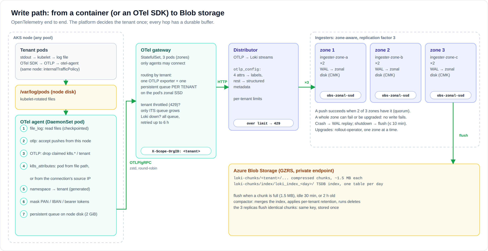
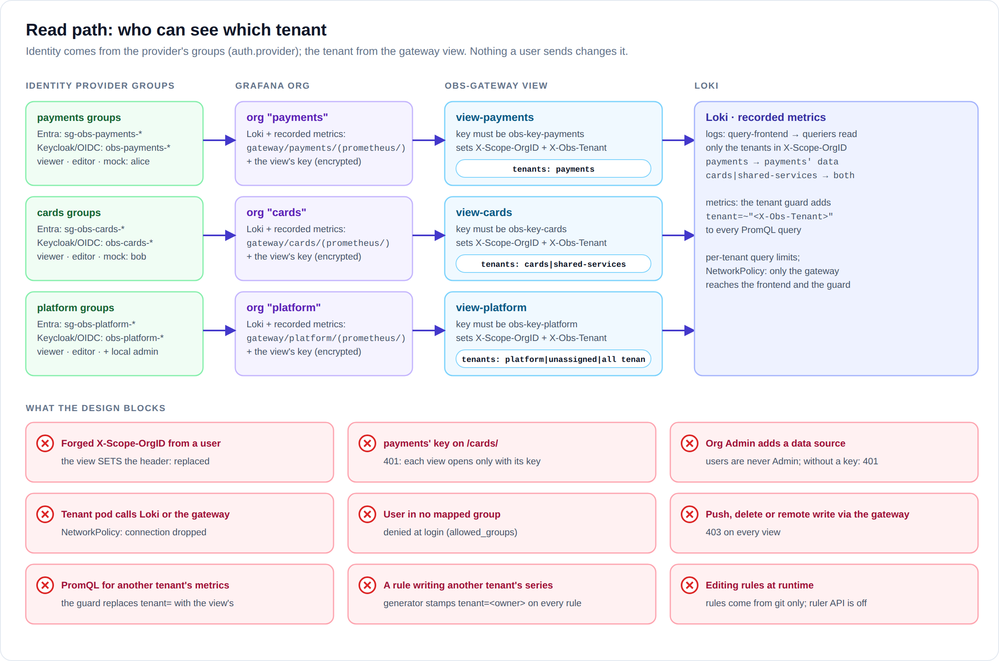

# 01 · Architecture

Two installations of this same design: **generic** (everything in the cluster, no Azure
service needed) and **Azure** (Blob, Key Vault, Entra ID, PostgreSQL flexible, managed
Prometheus around it). See [10 · Installations](10-installations.md). This page describes the
backend they share, with the Azure services as the reference.

## Scope and assumptions

- **One shared AKS cluster**, owned by the platform team. Tenants (application
  teams, business lines) get namespaces. Namespace isolation (RBAC, quotas,
  NetworkPolicies, Pod Security) is already in place and is the platform's job.
- The bank has standardised on **OpenTelemetry**. Collection is the upstream OpenTelemetry
  Collector, and the wire protocol is **OTLP from the node to Loki**.
- Workloads either **log to stdout/stderr** (nothing to change), or **export
  logs with an OpenTelemetry SDK** to the collector on their node.
- People read logs in **Grafana**, signing in with the bank's identity provider: **Entra ID** by
  default, or Keycloak / any OIDC provider (`auth.provider`). Test clusters can use mock users.
- AKS runs in a region with **3 availability zones**, with Azure CNI (Cilium or
  Calico), the OIDC issuer and Workload Identity enabled, a private API server,
  and egress through the hub firewall.
- Sizing reference: **~1 TB/day of raw logs**, tens to a few hundred tenants
  ([05 · Sizing](05-sizing-and-capacity.md)).

## Components

| Component | Runs as | Replicas (M profile) | State | Why it exists |
|---|---|---|---|---|
| **OTel agent** | DaemonSet, ns `otel-agent` | 1 per node | read checkpoints + export queue on the node (`/var/lib/otelcol`) | Reads container logs; accepts OTLP from pods on its node; decides the tenant; masks secrets; writes to Kafka |
| **Kafka** (Strimzi) | Kafka cluster `logs`, ns `kafka` | 3 brokers (one per zone) + 3 KRaft controllers | topic `otel-logs` on zonal SSDs, 3 replicas, 24 h | The replicated buffer between the tiers: holds an outage's backlog off the nodes, replays it in order ([ADR 0010](adr/0010-kafka-in-cluster.md)) |
| **OTel gateway** | StatefulSet, ns `otel` | 3 (one per zone) | **one persistent queue per tenant** on a zonal SSD | Consumes Kafka; routes by tenant; isolates tenants from each other; OTLP → Loki |
| **Distributor** | Deployment, ns `loki` | 3 → 9 (HPA) | none | Native OTLP endpoint; per-tenant limits; replicates ×3 |
| **Ingester** | 3 StatefulSets, one per zone | 2 per zone | WAL on a zonal Premium SSD (CMK) | Holds the last ~2 h, builds chunks, flushes to Blob |
| **Query frontend** | Deployment | 2 | none | Splits and shards queries; **results cache**; per-tenant queue |
| **Query scheduler** | Deployment | 2 | none | Fair queue per tenant |
| **Querier** | Deployment | 4 → 16 (HPA) | none | Runs queries on Blob chunks and ingesters' recent data |
| **Index gateway** | StatefulSet | 3 (one per zone) | index on local disk (50 Gi) | Downloads the TSDB index once and serves it to the queriers and the ruler, so they don't each fetch and keep it ([08](08-design-questions.md#index-gateways-and-rulers)) |
| **Ruler** | StatefulSet | 2 (rule groups sharded) | remote-write WAL on disk | Runs each tenant's **recording rules** once a minute with its own querier; writes small series (`tenant=<owner>`) to the metrics store, so dashboards and alerts stop re-scanning logs ([ADR 0012](adr/0012-ruler-recorded-metrics.md)) |
| **Metrics store** (`obs-metrics`) | StatefulSet (Prometheus, receive-only) | 2 (both written) | 400 d of recorded series, 50 Gi | Holds the ruler's results |
| **Tenant guard** (`obs-metrics-proxy`) | Deployment (prom-label-proxy) | 2 | none | Forces `tenant=~<view's tenants>` on every query of the recorded metrics |
| **Compactor** | StatefulSet | 1 | working dir on disk | Compacts the index; per-tenant **retention**; deletes |
| **Memcached** (chunks, results) | StatefulSets | 3 + 2 | memory | Read-path caches ([08](08-design-questions.md#caching)) |
| **Overrides exporter**, **rollout-operator** | Deployments | 1 each | none | Limits as metrics; ingester upgrades one zone at a time |
| **obs-gateway** (read gateway) | kgateway (Envoy) | 3 → 9 | none | The only way into the read path (logs and recorded metrics); sets the tenant headers |
| **Grafana** | Deployment, ns `grafana` | 2 | PostgreSQL | UI, one org per tenant, alerting |
| **External Secrets** | Deployment | 1+ | none | Key Vault → Kubernetes Secrets (Azure; generic: the chart generates them) |
| **Keycloak** (generic) | Keycloak operator, ns `keycloak` | 2 | PostgreSQL (Percona) | Sign-in when there is no Entra ID: realm `obs`, a group per tenant role |
| **grafana-sync** | CronJob, ns `grafana` | every 10 min | none | Orgs + one Loki data source per tenant, with the view's current key |

Azure side (Terraform, [`infra/terraform`](../infra/terraform)):
- Blob Storage (GZRS)
- Key Vault (HSM keys)
- managed identities with Workload Identity
- a disk encryption set
- three zonal node pools
- PostgreSQL flexible server (zone-redundant HA)
- managed Prometheus rule groups
- diagnostic settings

## Write path: OpenTelemetry end to end

1. **Stdout**: the kubelet writes each container's output to
   `/var/log/pods/<ns>_<pod>_<uid>/<container>/*.log`. The **agent** on that node
   reads it with the `file_log` receiver. The `container` parser takes namespace, pod and
   container from the **file path**, which the kubelet writes and the app can't change.
2. **OTel SDK**: the app exports OTLP to `otel-agent.otel-agent.svc:4317` (gRPC) or `:4318`
   (HTTP). The Service's `internalTrafficPolicy: Local` keeps the connection on the app's own
   node. The agent:
   - **deletes** every `k8s.*` and tenant attribute the app sent;
   - asks the Kubernetes API which pod owns the connection's **source IP** (`k8s_attributes`,
     association `from: connection`).

   An app can say what it likes about itself; the platform decides who it is.
3. The agent then:
   - adds workload metadata;
   - sets `service.name` if the app didn't;
   - sets the tenant from the namespace (**generated** from `tenants.yaml`);
   - **masks** card numbers, IBANs and bearer tokens in bodies *and* attributes;
   - queues the result in a **persistent queue on the node's disk** (2 GiB).
4. The agent produces to the **Kafka** topic `otel-logs` (TLS, SCRAM user `otel-agent`,
   zstd, `acks=all`), one message per resource, keyed so each stream stays on one partition.
   Kafka keeps 3 replicas in 3 zones for 24 h.
5. The **gateways** consume the topic as one consumer group. Each gateway pod:
   - routes every record by tenant into **that tenant's own exporter and persistent queue**
     on its zonal SSD, and commits the offset only then;
   - pushes to Loki's OTLP endpoint (`/otlp/v1/logs`) with `X-Scope-OrgID: <tenant>`.

   Without Kafka (`overlays/no-kafka.yaml`), the agents send OTLP/gRPC to the gateways
   directly instead.
6. The **distributor** checks the tenant's limits and turns OTLP into Loki streams. Only
   four bounded resource attributes become stream labels:

   | OTel attribute | Loki label |
   |---|---|
   | `k8s.cluster.name` | `k8s_cluster_name` |
   | `k8s.namespace.name` | `k8s_namespace_name` |
   | `k8s.container.name` | `k8s_container_name` |
   | `service.name` | `service_name` |

   Everything else (pod, node, trace ID, log attributes) becomes structured metadata.
   The distributor then writes each stream to **3 ingesters, one per zone**, and
   acknowledges once 2 have it.
7. The ingesters flush compressed chunks to Blob. The compactor applies each tenant's retention.

Why two collector tiers, why Kafka between them, and what each buffer protects against:
[08 · Design questions](08-design-questions.md#kafka),
[ADR 0007](adr/0007-opentelemetry-collection.md) and [ADR 0010](adr/0010-kafka-in-cluster.md).

## Read path

1. The user signs in to Grafana with the identity provider (`auth.provider`). Their groups decide
   their org and role. A local `admin` exists in every mode (initial password `change-me-now`).
2. Each org has two data sources, both through its view and with the view's key:
   - **Loki**: `http://obs-gateway.loki.svc:8080/<view>/`;
   - **Log metrics (recorded)**: `…/<view>/prometheus/`.
3. The **read gateway** checks the key and **sets** the tenant:
   - logs: `X-Scope-OrgID`, then on to the query frontend;
   - recorded metrics: `X-Obs-Tenant`, then on to the **tenant guard**, which adds
     `tenant=~"<tenants>"` to every PromQL selector before the **metrics store** answers.
4. The **query frontend**:
   - asks the **results cache**;
   - splits the rest into 1 h pieces and shards them;
   - queues the pieces in the **query scheduler**, one queue per tenant, served in turn.
5. The **queriers** pull pieces from the scheduler when they have a free worker. Nothing
   balances them; the busiest just pull less ([08](08-design-questions.md#how-do-queries-get-spread-over-the-queriers)).
   Each querier reads:
   - the index, through the **index gateways**;
   - the chunks, from the **chunks cache**, then Blob;
   - recent data, from the ingesters.
6. Separately, the **ruler** runs every tenant's recording rules once a minute with its own
   querier (ingesters, index gateways, Blob). It writes the results to the metrics store, so
   dashboards and alerts on log counts read those small series instead of steps 4-5.

## Why this shape

| Decision | Alternative | Why this one | ADR |
|---|---|---|---|
| Distributed Loki, zone-aware ingesters | Simple Scalable | Independent scaling; a zone can fail without failing writes | [0001](adr/0001-distributed-zone-aware-loki.md) |
| Platform decides the tenant from the namespace | Apps send their own tenant header | A tenant can't write into another tenant | [0002](adr/0002-tenant-is-the-namespace.md) |
| Read gateway with one view per org | OAuth passthrough; nginx | The header comes only from the platform | [0003](adr/0003-read-gateway-views.md) |
| Few labels; the rest as structured metadata | Pod as a label | Bounded stream count | [0004](adr/0004-labels-and-structured-metadata.md) |
| Blob GZRS + Workload Identity + CMK | Account keys; LRS | No secrets; survives a zone and (with delay) a region | [0005](adr/0005-azure-blob-workload-identity.md) |
| **Kafka in the cluster, between the collector tiers** | No bus ([0006](adr/0006-no-kafka-buffer.md)); Event Hubs; Loki's Kafka ingest | Outage backlog off the nodes, replicated; 24 h replay; same in both installations | [0010](adr/0010-kafka-in-cluster.md) |
| **OpenTelemetry Collector, agent + gateway** | Grafana Alloy; agent only | Bank standard; per-tenant queues; vendor-neutral OTLP | [0007](adr/0007-opentelemetry-collection.md) |
| **Memcached caches on the read path only** | Redis; no cache; write cache | Loki's tested design; loss costs speed, never data | [0008](adr/0008-caching.md) |
| **Index gateways + a ruler with recording rules** | Queriers fetching the index; dashboards and alerts scanning logs | The index is fetched once; log metrics are computed once, read many times; rule load stays off people's queues | [0012](adr/0012-ruler-recorded-metrics.md) |
| **Entra ID directly for Grafana SSO** (Azure); Keycloak installed (generic) | Keycloak brokering Entra ID | Existing MFA/CA/PIM; no extra critical system; tenants aren't token claims | [0009](adr/0009-entra-id-not-keycloak.md) |
| **Two installation profiles, one backend** | Azure only; two designs | Validate the backend once; run with or without Azure services | [0011](adr/0011-two-installation-profiles.md) |

## Versions (pinned in [`scripts/lib.sh`](../scripts/lib.sh))

| | Version |
|---|---|
| OpenTelemetry Collector | chart `open-telemetry/opentelemetry-collector` 0.173.1 → `otelcol-contrib` 0.160.0 |
| Loki | chart `grafana/loki` 7.3.0 → Loki 3.6.11 (native OTLP ingestion) |
| Grafana | chart `grafana-community/grafana` 13.2.5 → Grafana 13.2 |
| kgateway | v2.4.5 (Gateway API v1.6.1) |
| External Secrets | chart 2.11.0 |
| Strimzi / Kafka | operator 1.2.0 → Kafka 4.3.1 (KRaft) |
| Keycloak | operator + server 26.8.0 |
| Metrics store / tenant guard | Prometheus v3.5.0 (receive-only) / prom-label-proxy v0.15.1 |
| Terraform azurerm | ~> 4.40 (tested with 4.81) |

Loki, Grafana and kgateway match the RKE2 lab ([`../soft-tenancy`](../../soft-tenancy)).
The lab collects with Grafana Alloy; this design uses the OpenTelemetry Collector.
