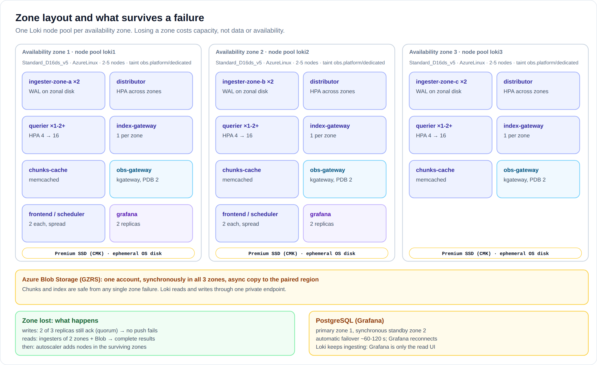
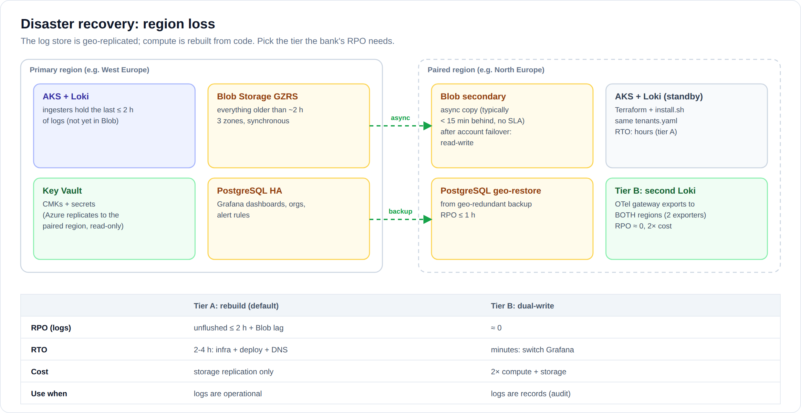

# 04 · Reliability and disaster recovery

## Targets (proposal: agree them with the service owners)

| SLO | Target | Measured by |
|---|---|---|
| Log ingestion success | 99.9 % of pushes accepted (excl. tenants over their own limits) | `loki_request_duration_seconds_count{route="otlp_v1_logs"}` by status |
| Ingestion delay | 99 % of lines queryable within 60 s | collector queue sizes (`otelcol_exporter_queue_size`) + a canary query |
| Query availability | 99.5 % of queries succeed | query-frontend 5xx rate |
| Durability | no loss of acknowledged logs, short of a region loss | RF3 + WAL + GZRS |
| Collection coverage | OTel agent ready on 100 % of nodes | `OtelAgentMissingOnNodes` alert |

## How each failure is handled

| Failure | Effect | Why it's OK / what happens |
|---|---|---|
| **One Loki pod crashes** | none visible | Stateless pods are replaced; ingesters replay their WAL; other replicas serve |
| **One node lost** | none visible | PDBs + anti-affinity keep replicas on different nodes; zone-aware ingesters: at most 2 of 6 affected, same zone |
| **A whole availability zone lost** | capacity −⅓ | Writes: 2 of 3 replicas still acknowledge (quorum). Reads: other zones + Blob. The autoscaler adds nodes in the surviving zones' pools. Blob and PostgreSQL are zone-redundant |
| **Blob Storage unavailable** | queries of older data fail; ingesters keep accepting | Ingesters retry flushes and keep data in memory + WAL until Blob is back. `LokiIngesterFlushFailures` fires. WAL disks are sized for hours of backlog |
| **Loki write path down** | no data loss while the queues last | each tenant's persistent queue on the OTel gateways fills (≈ 1 h of all logs at M, sized by `gatewayQueueMiB`), then the agents' node queues, then the kubelet files ([08](08-design-questions.md#kafka)) |
| **OTel gateway pod lost** | none visible | agents balance over the other pods; its queue waits on its PVC and drains when it returns |
| **A tenant throttled by Loki (429)** | only that tenant is delayed | only its own gateway queue grows; `OtelGatewayTenantQueueFilling` at 50 % |
| **A tenant floods** | only that tenant is throttled | Per-tenant rate/stream limits → 429 for that tenant; hot streams are sharded; queries have per-tenant queues and querier shards |
| **A heavy query** | only that tenant slows | `max_queriers_per_tenant`, `max_query_parallelism`, `query_timeout`, `max_query_length`, fair scheduling |
| **Grafana down** | nobody sees logs; ingestion unaffected | 2 replicas, PDB; state in PostgreSQL with zone-redundant HA |
| **Key Vault unreachable** | new pods can't sync secrets; running pods unaffected | ESO keeps the last Secret; storage CMK cached by Azure |
| **Compactor down** | retention delayed | singleton by design; `LokiRetentionNotRunning` after 3 h |
| **Region lost** | see DR below | |

## Upgrades without downtime

- **Loki**: `helm upgrade`. Stateless components roll with their PDBs (`maxUnavailable: 1`).
  Ingesters are updated **one zone at a time** by the rollout-operator: each
  ingester flushes (up to 10 min, `terminationGracePeriodSeconds: 600`), the
  zone comes back, then the next zone.
- **AKS node images and Kubernetes versions**: one node pool per zone, with
  `max_surge = 1` and a 30-min drain timeout. Upgrade `loki1`, check, then `loki2`,
  then `loki3`: never two zones at once. The rollout-operator's webhooks must be
  reachable by the API server, or drains will hang (`templates/networkpolicies-loki.yaml`).
- **Schema changes** (a new `schemaConfig` entry): add a new `from:` date **in the
  future**. Never edit an existing entry.

## Node log buffer

When Loki is unreachable, the logs wait in `/var/log/pods` on each node. The
kubelet rotates them at `containerLogMaxSize` × `containerLogMaxFiles` per
container: on AKS the defaults are 50 MiB × 5. A chatty container writing 1 MB/s
fills 250 MB in about 4 minutes, after which the oldest lines are gone. For
longer outages, raise these in the node pools' kubelet config (`kubelet_config`
in Terraform), keeping node disk size in mind. The OTel agent remembers its position per
file in `/var/lib/otelcol` on the node, so a restarted agent continues where it
stopped and neither re-sends nor skips lines.

## Disaster recovery (region loss)

| | **Tier A: rebuild (default)** | **Tier B: dual-write** |
|---|---|---|
| How | Blob GZRS replicates to the paired region. After a region loss: customer-initiated **account failover**, then Terraform + `install.sh` in the paired region, pointed at the same account | The OTel gateway has a second exporter per tenant; a second, smaller Loki runs in the paired region with its own storage account |
| RPO | Unflushed ingester data (≤ 2 h, `max_chunk_age`) + Blob geo-lag (typically < 15 min, no SLA) | ≈ 0 for data that reached either region |
| RTO | 2-4 h (infra + deploy + DNS) | minutes (point Grafana at the other region) |
| Cost | storage replication | ≈ 2× compute and storage |
| Choose when | logs are operational data | some streams are records that must not be lost (audit trails) |

Tier B doesn't have to cover every tenant: dual-write only the streams that need it
(e.g. the `audit-*` namespaces) with an extra exporter in the OTel gateway.

### DR runbook (tier A), in short

1. Declare the disaster, following the bank's process.
2. Start the customer-initiated failover of the storage account (`az storage account failover`).
   The account becomes LRS in the secondary region; re-enable GZRS afterwards.
3. `terraform apply` with the paired region's `tfvars`. The Key Vault is available read-only in
   the paired region, so creating new secrets may wait until it fails over.
4. PostgreSQL: geo-restore the Grafana database from the geo-redundant backup.
5. `scripts/install.sh` against the DR cluster (same `tenants.yaml`).
6. Repoint `grafana.obs.bank.internal` in DNS.
7. Test at least **once a year**, as a DR exercise with a copy of the registry.

## Backups

| What | Backup |
|---|---|
| Logs (Blob) | GZRS geo-replication + 14-day soft delete (accidental deletes). **Not** a backup against retention deletes, which are intended |
| Grafana DB | PostgreSQL PITR 35 days + geo-redundant backups |
| Config | this git repository; Key Vault soft delete + purge protection |
| Gateway keys | Key Vault (regenerable: `tenant-keys.sh --rotate`) |
