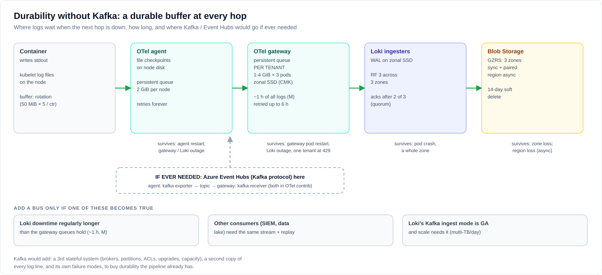
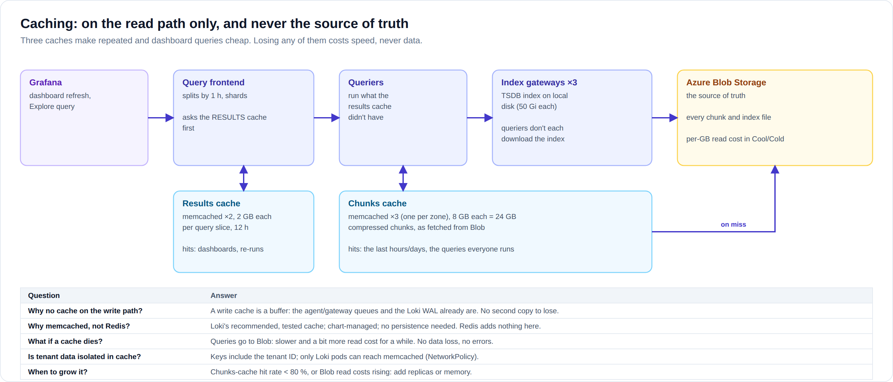

# 08 · Design questions: Kafka, caching, OpenTelemetry

Answers to the questions architecture boards, risk and operations ask most
often. Each answer states the reason, what was verified, and when the answer
would change.

## Kafka

### "Why is there no Kafka (or Event Hubs) in front of Loki?"

Because the job a bus would do, **not losing logs while something downstream
is down**, is already done at every hop, on disk. A bus would be a fourth
buffer, and a third stateful system to run.

| Hop | Durable buffer | Survives |
|---|---|---|
| Container → node | kubelet log files (`/var/log/pods`) | the agent being down (for as long as rotation allows) |
| OTel agent | read checkpoints + **persistent queue, 2 GiB per node**, on the node's disk | agent restart; gateway or Loki outage |
| OTel gateway | **persistent queue per tenant** (1-4 GiB by tier) × 3 pods, on zonal SSDs (CMK); retried up to 6 h | gateway pod restart; a Loki outage; **one tenant being throttled** |
| Loki ingesters | WAL on zonal SSD, **3 copies in 3 zones**, ack after 2 | pod crash; a whole zone |
| Blob Storage | GZRS (3 zones sync + paired region async), soft delete | zone loss; region loss (with lag) |

How long the buffers last is a sizing choice:
- **Gateway tier**: the example registry gives 15 GiB of queue per gateway pod (the sum of
  every tenant's `gatewayQueueMiB`), so 45 GiB over 3 pods. At the M profile's ~12 MB/s
  average, that is **about an hour of every tenant's logs** while Loki is down.
- **Agents**: each node's 2 GiB queue adds more on top.

To ride out longer outages, raise `gatewayQueueMiB` and the gateway PVC
([05](05-sizing-and-capacity.md#collectors)). Queued data is retried for up to 6 h.

Each tenant's queue is its own, so a tenant hitting its Loki limit fills **its**
queue, not the others' ([limits below](#limits-of-the-no-kafka-design)).

What was verified:
- The queues, retries and routing are configured and pass the collector's own validation
  (`scripts/validate.sh`).
- `scripts/pipeline-test.sh` runs agent → gateway → Loki and checks per-tenant delivery
  through the queues.
- The failure metrics used by the alerts (`otelcol_exporter_enqueue_failed_log_records`,
  `…send_failed…`) were produced by forcing failures.

### "What does Kafka buy that this doesn't?"

| Kafka gives | Here |
|---|---|
| Buffer during outages | ✔ node + per-tenant gateway queues + Loki WAL |
| Absorb bursts | ✔ queues + Loki's per-tenant burst limits |
| **Replay** (re-read the last N days) | ✘ Not needed for Loki today. Needed if a second system must re-consume the stream. |
| **Fan-out** to other consumers (SIEM, data lake, fraud analytics) with independent offsets | Partly: the gateway can export to a second destination directly. A bus is better once there are several independent consumers. |
| Decoupling teams (producers/consumers deployed separately) | Not relevant: the platform owns both ends |

### "What would Kafka cost us?"

- **Another stateful platform**:
  - brokers (or an Event Hubs namespace), partitions, consumer groups;
  - ACLs (whoever can produce to the log topic can write into any tenant);
  - capacity planning, upgrades, DR, and its own monitoring.
- **A second full copy** of every log line, plus its own encryption, retention and audit
  controls, which a bank must also evidence.
- **More latency and more failure modes** between the pod and Grafana.
- A **tenant-isolation risk** to design around: a shared topic partition is shared
  head-of-line blocking. Per-tenant gateway queues avoid it, up to the limit below.

### "When would we add it, and how?"

Add a bus when **one** of these becomes true:
1. Planned Loki downtime must regularly exceed what the gateway queues can reasonably hold.
   About 1 h at the M profile as shipped; more with bigger queues.
2. **Other consumers** need the same stream with replay: SIEM, a data lake, fraud analytics.
3. Scale reaches multiple TB/day and Loki's Kafka-based ingest architecture is GA. It exists
   in Loki 3.6 (`-distributor.kafka-writes-enabled`) but is still experimental.

How it would fit:
- On Azure, **Event Hubs (Premium or Dedicated)** with the Kafka endpoint, a private endpoint,
  a CMK and Entra auth.
- It goes **between the agent and the gateway**, using OpenTelemetry's own
  `kafka` exporter (agent) and `kafka` receiver (gateway). Both are in the contrib
  collector already pinned here, so no new software.
- The tenant travels in the OTLP resource attributes inside each record.
- Only the agents' identity may produce to the topic.

The rest of the design doesn't change. See [ADR 0006](adr/0006-no-kafka-buffer.md).

### Limits of the no-Kafka design

Be upfront about these when asked:
- **A tenant whose gateway queue is completely full** (throttled for longer than its
  queue lasts) makes the gateway reject new data for that tenant. The agents then retry
  their whole batch, so other tenants' records on the same nodes are **delayed**.
  They are not lost: they wait in the agents' queues, and Loki drops exact duplicates.
  - `OtelGatewayTenantQueueFilling` fires at 50 %, long before that point.
  - The fix is operational: raise the tenant's limit, or its queue.
- Data retried for more than 6 h at the gateway is dropped and counted
  (`OtelDroppingLogs`, critical).
- A node lost **together with** a gateway outage loses what was still in that node's queue.

A Kafka design has equivalent limits: partitions shared between tenants, broker disk
full, retention expiring during a long consumer outage.

### "Isn't a DaemonSet with a disk queue less safe than Kafka?"

The node queue exists for short outages and restarts. The durable, zone-spread,
per-tenant buffer is the **gateway** tier, on persistent disks that outlive pod and node
failures. After that come Loki's replicated WAL and zone-redundant storage. A lost node
loses at most the data still in its own queue, and only if the gateways were down at the
same time. Kafka would have the same exposure for data not yet produced from that node.

## Caching

### "Is there any caching?"

Yes, three caches, all on the **read path**:

| Cache | Tech | Size (M) | What it holds | Hit when |
|---|---|---|---|---|
| **Results cache** | memcached ×2 | 2 × 2 GB, entries valid 12 h | results of 1-hour query slices, per tenant | dashboards refresh; the same query runs again |
| **Chunks cache** | memcached ×3 (spread over zones) | 3 × 8 GB | compressed chunks fetched from Blob | recent data; queries many people run |
| **Index cache** | index gateways ×3 | 50 GiB disk each | the TSDB index | every query (label and series lookups) |

The chunks and results caches are part of the `grafana/loki` chart and sized in
[`charts/log-platform/values.yaml`](../charts/log-platform/values.yaml).

### "Why no cache on the write path?"

A write-path cache is a buffer by another name, and the write path already has
three durable ones (agent, gateway, WAL). A cache in front of them would add a copy
that can be lost, without adding durability.

### "Why memcached and not Redis (or Azure Cache for Redis)?"

- Memcached is what Loki is designed and tested with at large scale, and the chart deploys
  and wires it.
- The caches need **no persistence and no replication**: every entry can be rebuilt from
  Blob.
- Redis would add features that aren't used (persistence, data types), and Azure Cache for
  Redis would add a network hop, cost, and another private endpoint.

### "What happens if a cache fails?"

Queries go to Blob Storage for the missing entries: they get slower and a little more
expensive (read transactions, and per-GB reads in Cool/Cold) until the cache refills.
**No query fails and no data is lost.** Caches are never the source of truth.

### "Is cached data a confidentiality risk?"

- Cache keys include the tenant ID, and a query can only read its own tenant's keys.
- Memcached is reachable only by Loki pods (`templates/networkpolicies-loki.yaml`) on
  dedicated nodes.
- The data is in memory only, and never written to disk (persistence is off).
- If the bank requires encryption in transit **inside** the cluster, enable node-to-node
  encryption (WireGuard with Cilium/ACNS). This covers memcached traffic too
  ([03](03-security-and-compliance.md#network)).

### "Why not a bigger or second-level cache?"

The chart supports a second-level (L2) chunks cache for longer-range queries. It stays off
until the numbers justify it. Grow the caches when:
- the chunks-cache hit rate stays below ~80 %; or
- Blob read costs climb because people often query weeks-old data.

First add memcached replicas or memory; turn on `chunksCache.l2` only after that.
See [ADR 0008](adr/0008-caching.md).

## OpenTelemetry

### "Why an agent and a gateway?"

| Concern | Agent only | Agent + gateway (this design) |
|---|---|---|
| Tenant isolation on export | every node would need one exporter per tenant (N nodes × M tenants connections, tiny batches) | one exporter **and queue per tenant**, in 3 pods |
| A tenant throttled by Loki (429) | blocks that node's shared queue, and every tenant on it | only that tenant's gateway queue grows |
| Durable buffer on persistent disks | node disks only | zonal SSDs, zone-spread |
| Batching efficiency | small per-node batches | large per-tenant batches |
| Where a bus would go | nowhere clean | between the tiers, if ever needed |

This is the standard OpenTelemetry deployment pattern: agents near the workloads,
gateways in front of the backend.

### "Why the OpenTelemetry Collector and not Grafana Alloy?"

- The bank standard is OpenTelemetry.
- Upstream collector config, OTLP on the wire, and no vendor-specific agent language.
- The same collectors can carry **traces and metrics** later with no new agent: add
  pipelines, and backends such as Tempo, Mimir or Azure Monitor.

Alloy (a Grafana distribution of the collector) would work too; the RKE2 lab uses it.
See [ADR 0007](adr/0007-opentelemetry-collection.md).

### "Can a tenant fake its identity through OTLP?"

No:
- The agent deletes every `k8s.*` and tenant attribute from OTLP input.
- It identifies the sender by the pod behind the connection's source IP. Pod IPs can't be
  forged in-cluster: the CNI enforces anti-spoofing, and Pod Security forbids `hostNetwork`
  for tenants.
- An unknown sender lands in `unassigned`, visible to the platform only.
- The gateway accepts connections only from the agents.

Verified by `scripts/pipeline-test.sh`: a push claiming `cards` from an unknown sender lands
in `unassigned`, not `cards`. When the stripping step was removed as a test, the forged push
got into `cards` and the test failed, as it should. The same check with a real Kubernetes
API is in `scripts/kind-e2e.sh` (written, not yet run: it needs more Docker disk than this machine had free).

### "Do apps have to change?"

No. Logging to stdout keeps working unchanged. Apps that already use an OpenTelemetry SDK
can export OTLP to `otel-agent.otel-agent.svc:4317` and gain trace IDs in their logs.
They also need an egress rule to that Service in their namespace's NetworkPolicy.

## Identity

### "Why not Keycloak?"

Grafana signs in with **Entra ID directly**, so the bank's MFA, Conditional Access, PIM and
access lifecycle apply as they are. Keycloak would be one more critical, stateful system in
every login path, and it wouldn't add anything here: tenants are decided by namespaces and
read-gateway keys, not by token claims.

It becomes the right choice for external tenants with their own identity providers, users
from several Entra tenants, or if the bank's IAM standard is Keycloak. Switching is one
chart setting, `auth.provider: keycloak`. See [ADR 0009](adr/0009-entra-id-not-keycloak.md).

