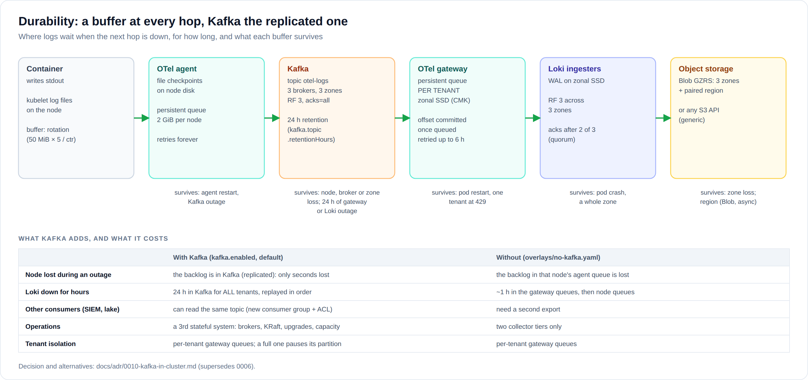

# 08 · Design questions: Kafka, caching, OpenTelemetry

Answers to the questions architecture boards, risk and operations ask most
often. Each answer states the reason, what was verified, and when the answer
would change.

## Kafka



### "Where does Kafka go, and why?"

Between the two OpenTelemetry tiers, in the cluster
([ADR 0010](adr/0010-kafka-in-cluster.md)):

```
agent (every node) ──TLS + SCRAM──► Kafka topic otel-logs ──consumer group──► gateway ──► Loki
```

- Strimzi runs Kafka in namespace `kafka`: 3 brokers (one per zone) and 3 KRaft
  controllers. Replication factor 3, `acks=all`, `min.insync.replicas` 2, 24 h retention.
- **Not in front of Loki's distributors**, and not a Loki feature: the gateway still does
  the per-tenant routing, queueing and `X-Scope-OrgID`. Loki is unchanged.
- The tenant travels in the OTLP resource attributes inside each message, and only the
  agents can produce:
  - Kafka ACLs: the `otel-agent` user may only write, `otel-gateway` may only read;
  - Strimzi's NetworkPolicy admits only the agent and gateway pods.

What it adds, compared with the earlier design without a bus ([ADR 0006](adr/0006-no-kafka-buffer.md)):
- **The outage backlog leaves the nodes.** While the gateways or Loki are down, logs pile up
  in Kafka, replicated across 3 zones, instead of in each node's 2 GiB agent queue. A node
  lost during an outage no longer takes its backlog with it.
- **Up to 24 h of Loki or gateway outage**, replayed in order (`kafka.topic.retentionHours`,
  sized in [05](05-sizing-and-capacity.md#kafka)). Without Kafka it was about 1 h in the
  gateway queues at the M profile.
- **Replay and fan-out.** Another consumer (SIEM, data lake) can read the same topic with its
  own consumer group and a read ACL, without touching the pipeline.

### "Every hop still has a buffer. Which one does what?"

| Hop | Durable buffer | Survives |
|---|---|---|
| Container → node | kubelet log files (`/var/log/pods`) | the agent being down (for as long as rotation allows) |
| OTel agent | read checkpoints + **persistent queue, 2 GiB per node** | agent restart; a Kafka outage |
| **Kafka** | topic `otel-logs`, **3 replicas in 3 zones**, 24 h | node, broker or zone loss; gateway or Loki outage up to 24 h |
| OTel gateway | **persistent queue per tenant** on zonal SSDs; offset committed once queued | gateway pod restart; **one tenant being throttled** |
| Loki ingesters | WAL on zonal SSD, **3 copies in 3 zones**, ack after 2 | pod crash; a whole zone |
| Object storage | Blob GZRS (3 zones + paired region), or the S3 store's own replication | zone loss; region loss (Blob, with lag) |

### "Doesn't a shared topic break tenant isolation?"

Not toward Loki. Each tenant still has its own gateway queue and exporter, so a tenant at
its Loki limit (429) only fills **its** queue.

The limit is one step further. If a tenant's gateway queue is **completely full**:
- the gateway can't accept that tenant's records, so it doesn't commit the offset;
- the partition is retried with backoff (`message_marking.after: true`, `error_backoff`);
- other tenants whose streams share that partition wait with it. They are delayed, not lost:
  their records stay in Kafka.

`OtelGatewayTenantQueueFilling` fires at 50 %, and `KafkaConsumerLagHigh` when the gateways
fall behind. The fix is operational: raise the tenant's limit or its `gatewayQueueMiB`.

Without Kafka, the same full queue pushes back on the agents of the nodes that send that
tenant's logs, which is the same blast radius in another place. One topic per tenant would
remove it, at the cost of hundreds of topics; ADR 0010 records when to revisit.

### "What does Kafka cost us?"

- **A third stateful system**:
  - brokers, KRaft quorum, disks (3 × 500 Gi at M);
  - Strimzi and Kafka upgrades;
  - partitions, ACLs, capacity;
  - its own alerts and runbook ([06](06-operations-runbook.md#kafka)).
- **A second copy of every log line for 24 h**, with the same encryption and access controls
  as the rest of the pipeline. Disk encryption is the cluster's (CMK on AKS); the listener
  is TLS.
- **A little latency**: agents batch for up to 1 s and Kafka adds milliseconds. Logs reach
  Grafana a second or two later than without it.

### "Can we turn it off?"

Yes. List `no-kafka.yaml` in `environments/<env>/overlays.txt`:
- the agents send OTLP straight to the gateways again (ADR 0006);
- the chart drops the Kafka objects;
- the NetworkPolicies switch back.

Nothing else changes. `scripts/validate.sh` checks both variants.

### "Why not Event Hubs, or Loki's own Kafka mode?"

- **Event Hubs (Kafka endpoint)**: an Azure dependency. The generic installation must run
  without Azure ([ADR 0011](adr/0011-two-installation-profiles.md)), and one backend design is
  validated for both. It also needs Entra OAuth or connection strings instead of SCRAM.
- **Loki's Kafka-based ingest** (`-distributor.kafka-writes-enabled`, block builders) is
  still experimental in Loki 3.6. Revisit when it is GA.

What was verified:
- The Kafka exporter, receiver, queues, retries and routing pass the collector's own
  validation, with and without Kafka (`scripts/validate.sh`).
- The Strimzi resources pass the Strimzi 1.2.0 CRD schemas.
- `scripts/pipeline-test.sh` runs agent → **Kafka** → gateway → Loki in containers and checks
  per-tenant delivery.

## Caching


### "Is there any caching?"

Yes, three caches, all on the **read path**:

| Cache | Tech | Size (M) | What it holds | Hit when |
|---|---|---|---|---|
| **Results cache** | memcached ×2 | 2 × 2 GB, entries valid 12 h | results of 1-hour query slices, per tenant | dashboards refresh; the same query runs again |
| **Chunks cache** | memcached ×3 (spread over zones) | 3 × 8 GB | compressed chunks fetched from Blob | recent data; queries many people run |
| **Index cache** | index gateways ×3 | 50 GiB disk each | the TSDB index | every query (label and series lookups) |

The chunks and results caches are part of the `grafana/loki` chart and sized in
[`charts/log-platform/values.yaml`](../charts/log-platform/values.yaml).

### "Why no cache on the write path?"

A write-path cache is a buffer by another name, and the write path already has
three durable ones (agent, gateway, WAL). A cache in front of them would add a copy
that can be lost, without adding durability.

### "Why memcached and not Redis (or Azure Cache for Redis)?"

- Memcached is what Loki is designed and tested with at large scale, and the chart deploys
  and wires it.
- The caches need **no persistence and no replication**: every entry can be rebuilt from
  Blob.
- Redis would add features that aren't used (persistence, data types), and Azure Cache for
  Redis would add a network hop, cost, and another private endpoint.

### "What happens if a cache fails?"

Queries go to Blob Storage for the missing entries: they get slower and a little more
expensive (read transactions, and per-GB reads in Cool/Cold) until the cache refills.
**No query fails and no data is lost.** Caches are never the source of truth.

### "Is cached data a confidentiality risk?"

- Cache keys include the tenant ID, and a query can only read its own tenant's keys.
- Memcached is reachable only by Loki pods (`templates/networkpolicies-loki.yaml`) on
  dedicated nodes.
- The data is in memory only, and never written to disk (persistence is off).
- If the bank requires encryption in transit **inside** the cluster, enable node-to-node
  encryption (WireGuard with Cilium/ACNS). This covers memcached traffic too
  ([03](03-security-and-compliance.md#network)).

### "Why not a bigger or second-level cache?"

The chart supports a second-level (L2) chunks cache for longer-range queries. It stays off
until the numbers justify it. Grow the caches when:
- the chunks-cache hit rate stays below ~80 %; or
- Blob read costs climb because people often query weeks-old data.

First add memcached replicas or memory; turn on `chunksCache.l2` only after that.
See [ADR 0008](adr/0008-caching.md).

## OpenTelemetry

### "Why an agent and a gateway?"

| Concern | Agent only | Agent + gateway (this design) |
|---|---|---|
| Tenant isolation on export | every node would need one exporter per tenant (N nodes × M tenants connections, tiny batches) | one exporter **and queue per tenant**, in 3 pods |
| A tenant throttled by Loki (429) | blocks that node's shared queue, and every tenant on it | only that tenant's gateway queue grows |
| Durable buffer on persistent disks | node disks only | zonal SSDs, zone-spread |
| Batching efficiency | small per-node batches | large per-tenant batches |
| Where the bus goes | nowhere clean | between the tiers: Kafka (ADR 0010) |

This is the standard OpenTelemetry deployment pattern: agents near the workloads,
gateways in front of the backend.

### "Why the OpenTelemetry Collector and not Grafana Alloy?"

- The bank standard is OpenTelemetry.
- Upstream collector config, OTLP on the wire, and no vendor-specific agent language.
- The same collectors can carry **traces and metrics** later with no new agent: add
  pipelines, and backends such as Tempo, Mimir or Azure Monitor.

Alloy (a Grafana distribution of the collector) would work too; the RKE2 lab uses it.
See [ADR 0007](adr/0007-opentelemetry-collection.md).

### "Can a tenant fake its identity through OTLP?"

No:
- The agent deletes every `k8s.*` and tenant attribute from OTLP input.
- It identifies the sender by the pod behind the connection's source IP. Pod IPs can't be
  forged in-cluster: the CNI enforces anti-spoofing, and Pod Security forbids `hostNetwork`
  for tenants.
- An unknown sender lands in `unassigned`, visible to the platform only.
- The gateway accepts connections only from the agents.

Verified by `scripts/pipeline-test.sh`: a push claiming `cards` from an unknown sender lands
in `unassigned`, not `cards`. When the stripping step was removed as a test, the forged push
got into `cards` and the test failed, as it should. The same check with a real Kubernetes
API is in `scripts/kind-e2e.sh` (written, not yet run: it needs more Docker disk than this machine had free).

### "Do apps have to change?"

No. Logging to stdout keeps working unchanged. Apps that already use an OpenTelemetry SDK
can export OTLP to `otel-agent.otel-agent.svc:4317` and gain trace IDs in their logs.
They also need an egress rule to that Service in their namespace's NetworkPolicy.

## Identity

### "Why not Keycloak?"

Grafana signs in with **Entra ID directly**, so the bank's MFA, Conditional Access, PIM and
access lifecycle apply as they are. Keycloak would be one more critical, stateful system in
every login path, and it wouldn't add anything here: tenants are decided by namespaces and
read-gateway keys, not by token claims.

It becomes the right choice for external tenants with their own identity providers, users
from several Entra tenants, or if the bank's IAM standard is Keycloak. Switching is one
chart setting, `auth.provider: keycloak`. See [ADR 0009](adr/0009-entra-id-not-keycloak.md).

